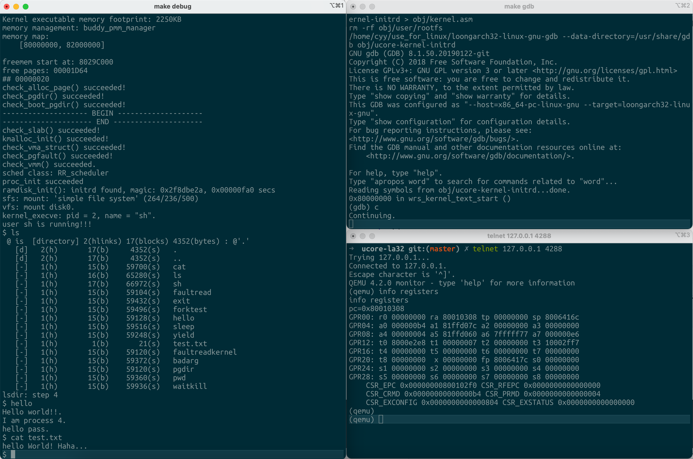

# uCore-LoongArch 32

本项目基于[ucore-thumips](https://github.com/z4yx/ucore-thumips)，将其移植到了LoongArch 32上。并成功跑通了所有的用户进程。

## 环境准备

你需要使用龙芯提供的`use_for_linux.zip`包（已知部分有参与项目的高校有拿到），里面含有loongarch32的`gcc`、`qemu`，以及一个Linux内核。推荐把`use_for_linux`文件夹放在你的主目录下（通常为`/home/($你的用户名)`），因为我们在Makefile中指定了该路径。

然后，你可能需要在龙芯提供的Loongarch 32资料包中找到一个gdb，也将它放在`use_for_linux`文件夹中。

最后，你可以开始尝试进行`make qemu`，由于龙芯提供的`gcc`和`qemu`的二进制可能存在一些链接库找不到，因此你可能需要安装一些软件包，如果在你的发行版的包管理器中找不到，推荐使用一个`CentOS 8`或者`Fedora 34`的Docker。

对于CentOS 8，使用以下命令可完成所需环境的安装：

```shell
yum install dnf-plugins-core
yum config-manager --set-enabled powertools
yum -y install epel-release
yum install brlapi libcacard usbredir libslirp pulseaudio-libs SDL2 gtk3 vte291 libaio libiscsi libnfs libssh numactl-libs
```

## Makefile操作

### 编译内核

```shell
make
```

### 在QEMU运行内核

```shell
make qemu
```

### 调试内核

在一个终端执行以下内容，它将以debug模式启动qemu，并监听在1234端口：

```shell
make debug
```

在另一个终端启动gdb：

```shell
make gdb
```

如果你想要连接qemu控制台来进行其他操作，我们默认将qemu控制台设置在了4288端口，你可以这么做：

```shell
telnet 127.0.0.1 4288
```

## 效果展示



## LA32与MIPS相比的一些较大改动说明

### 0. 跳转等指令不再需要软件延迟槽

这一点对于操作系统而言影响并不是很大，但是对于处理器核设计是非常重要的一点。

### 1. CP0与CSR

在LoongArch32中，CSR寄存器的作用相当于MIPS的CP0寄存器。

这里需要注意，`csrwr rd, csr_num`指令是将rd寄存器与csr_num进行对调，而非MIPS时代的`mtc0`只是单纯将值写入CP0寄存器。

### 2. 例外处理方式

在MIPS中，我们通过CP0的`Status`寄存器的`EXL`位来表示正在处理异常，因此当EXL为1时强制为内核态。

而LoongArch32的CSR中，取消了`Status`类似的寄存器，而分为了`PRMD`与`CRMD`。表示例外前状态和当前状态，而使用`ertn`指令（类似MIPS的`eret`）则会自动将`PRMD`还原到`CRMD`。这一点上比MIPS更加科学。

### 3. 存储空间管理

在MIPS架构中，我们熟悉的固定地址空间`kseg0`和`kseg1`等被舍弃。在LoongArch32中，被改为了通过CSR中的DMW寄存器配置地址映射窗口。这一部分代码位于`kern/init/entry.S`。考虑到以后可能需要在chiplab上使用PMON进行载入，因此我们按照了PMON相同的方式映射了一段内核的内存地址，也就是`0xa0000000-0xbfffffff`直接映射到`0x00000000-0x1fffffff`。而对于IO设备，以及载入用户进程需要进行的Uncached操作，配置了`0x80000000-0x9fffffff`直接映射到`0x00000000-0x1fffffff`。

对MIPS了解的同学不难看出，我们采用的配置方式非常类似于MIPS的KSEG0与KSEG1，但是对地址进行了对调。

### 4. 通用寄存器

LoongArch32中有一个比较特殊的地方，`v0`与`a0`，`v1`与`a1`寄存器尽管别名不同，但使用了相同的地址。这就导致uCore的MIPS版本原有的一些设计与它存在冲突，例如系统调用我们需要通过`a`寄存器传递参数，然后通过`v`0寄存器拿回系统的返回值。而对于一个特殊的系统调用`SYS_exec`需要通过`a`寄存器传递参数，如果我们把它的返回值直接写入`v0`会造成参数被覆盖。而由于LoongArch32中设计了8个`a`寄存器，因此这里直接将`a7`作为系统调用返回值的存储寄存器。

### 5. 系统调用

尽管LoongArch32的`syscall`指令含有15位立即数，但是在文档中并没有找到例外处理时在什么地方读取这个Code，因此这里将这一部分立即数全部设置为0。并使用`a7`寄存器传递系统调用号。

## 后续任务

### Cache一致性

因为做的时候并没有拿到Loongarch 32的FPGA软核，仅有QEMU，因此无法测试Cache一致性问题，因此暂时没有做写入指令后刷新数据Cache的指令。为了防止今后FPGA软核或者实际CPU上出现问题，目前进行了整体Uncached处理。

### 将环境打包Docker

我们对LoongArch32所需环境进行了Docker打包，但目前尚不能提供公开，因此暂未实现。